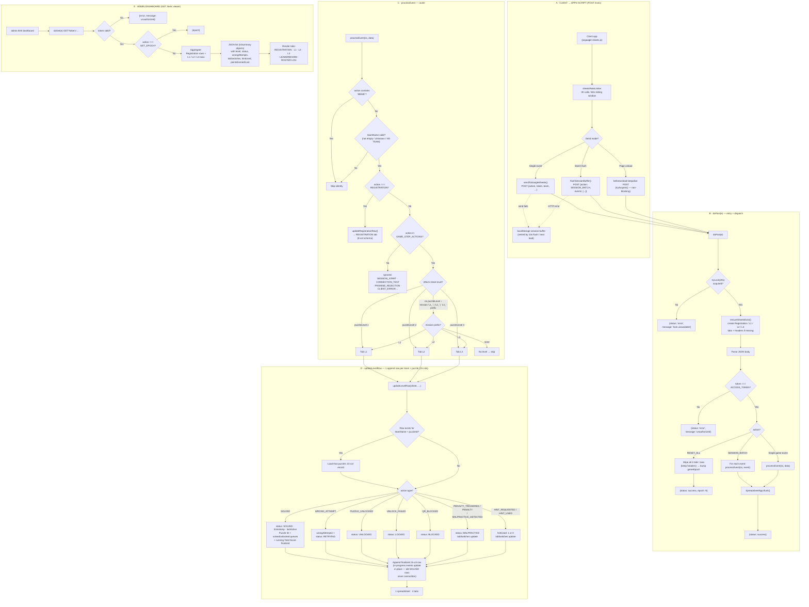

# ⚡ Pykachu Go — "Decode the code. Capture Pikachu."

A mobile-first, PWA-ready **binary signal decryption hunt** where teams solve
programming-riddle puzzles (Python & C++), scan QR codes, and progress through a
branching puzzle graph — all inside a Pokédex-styled CRT terminal UI.

Teams register with a team name + code, enter a `startCode` to unlock the first
puzzle, then solve puzzles in **forward-linked chains** where each correct answer
unlocks the next location. Progress, penalties, and points stream to a **Google
Sheets workbook** via a **Google Apps Script** backend, and an **Admin
dashboard** livetracks every team.

## What players do

1. Register with a team name and security key (mission level + language).
2. Scan the starting QR code or enter its start key.
3. Solve the displayed coding riddle (Python or C++ variant).
4. View the revealed next location and scan its QR code.
5. Continue until the final puzzle is complete.

---

## 🎮 Main features

- **Pokédex CRT theme** — pixel fonts, scanlines, sound effects, anti-blue-light
  CRT screen; installable PWA shell.
- **Dual-language riddles** — every puzzle ships a Python (`questionPython`) and
  a C++ (`questionCpp`) version; teams pick a language at registration.
- **Manual login on reload** — players must submit the login form again after a
  page reload; the last-used team name, security key, language and mission are
  prefilled from local storage (tap to sign out/in via the power button).
- **Branching puzzle graph** — each puzzle declares what it unlocks via
  `nextPuzzleId`, so progression is a forward-linked DAG (see
  [`assets/docs/PUZZLE_LINKING_SYSTEM.md`](assets/docs/PUZZLE_LINKING_SYSTEM.md)).
- **Per-team unlock queue** — no jumping ahead; only puzzles pushed onto a
  team's frontier become scannable.
- **QR scanning** — live camera QR decoder (jsQR) with pinch-to-zoom, plus
  manual code entry (`?linkid=XG01`) and path links (`/XG01`) as fallback.
- **Hint system** — hint requests cost a timed penalty; tab switching during the
  penalty triggers "malpractice" monitoring.
- **Tab-switch penalty system** — 2-second grace period, then a blocking
  countdown with penalty rings.
- **YouTube meme rewards** — scanning a meme QR plays a YouTube clip
  (`data/meme.json`) in a full-screen, looping, tap-to-unmute player with a safe
  return to the scanner when YouTube cannot load.
- **Anti-copy / anti-cheat blackout** — tab switch / window blur / print screen /
  5-finger touch / logic-freeze heartbeat detection all trigger a full-screen
  blackout overlay.
- **Tab-switch tally survives reload** — the tab-switch count is restored on
  reload and logging out / closing mid-riddle (step 3) counts as a tab switch, so
  a team can't clear its cheating tally by refreshing or quitting.
- **Google Sheets telemetry (per-puzzle notebook)** — every puzzle's events
  (scan, wrong attempts, hints, tab switches, timestamps) are collected
  **locally** in a per-puzzle notebook and ship as **one request** on solve.
- **Server-side team state** — every solve leaves its own permanent `L1`/`L2`/`L3`
  row carrying the team's Solved + Unlocked queues and running Total Score.
- **Smooth screen transitions** — rapid navigation cancels stale transitions so
  an older page cannot flash back over the current screen.
- **Sliding-window rate limiter** — protects the Apps Script endpoint from quota
  busts (see [Rate limiting](#rate-limiting)).
- **GitHub Actions Auto-Deploy** — push to `main` → GitHub Pages.
- **Installable PWA** — service worker + manifest, offline-capable shell.

---

## 🛠 Tech stack

| Layer | Tech |
|-------|------|
| Frontend | Vanilla JS (no framework), HTML partials, Tailwind CSS (compiled) |
| Styling | Tailwind CSS 3 (`npm run build`) + hand-written CSS modules |
| Backend | Google Apps Script (`scripts/GoogleAppsScript.gs`) |
| Storage | Google Sheets workbook (1 spreadsheet, 4 tabs) + `localStorage` state |
| Media | PokeAPI sprites/cries, YouTube IFrame API |
| Build | Tailwind CSS + Node script for runtime config |
| Hosting | GitHub Pages via Actions |
| LD deps (CDN) | jsQR, YouTube IFrame API |

---

## 📁 Project layout

```text
index.html                     Player application
admin.html                     Admin dashboard
manifest.json                  PWA manifest
service-worker.js              PWA cache strategy (bump CACHE_NAME on release)
tailwind.config.js             Tailwind config
.env.example                   Template for local runtime config
.html, .vscode/                Meta / editor files
data/puzzle.json               Puzzle graph, answers, scores, hints and locations
data/teams.json                Team roster used by the player login
data/meme.json                 Meme QR IDs and YouTube clip settings
html/                          Dynamically included screen partials
  step0.html                   Rules briefing
  step1.html                   Registration / login
  step2.html                   QR scanner
  startcode.html               Start-key entry
  step3.html                   Puzzle + answer form
  step4.html                   Success / completion screen
  hint.html                    Hint overlay
  penalty.html                 Tab-switch blocking overlay
  meme.html                    YouTube meme overlay
css/                           Tailwind input + component/shell/style modules
js/                            Game logic, scanner, Sheets client and meme player
  include.js                   Async partial loader (step0..step4, startcode, ...)
  config.js                    Reads runtime config → CONFIG + sheet endpoints
  state.js                     Global game state, session id, unlock queue, epoch
  audio.js                     SFX + BGM
  data-loader.js               Loads puzzle.json / teams.json / meme.json + preloader
  google-sheets.js             Telemetry + GET_TEAM_STATE fetch + event throttle
  notepad.js                   Per-puzzle notebook (0 requests while solving)
  rate-limiter.js              Sliding-window rate limiter
  ui.js                        Toasts, UI helpers
  screens.js                   Step (screen) flow engine
  scanner.js                   QR camera + manual entry + zoom
  meme.js                      YouTube meme player
  penalty.js                   Tab-switch penalties + grace period
  hint.js                      Hint request + penalty + malpractice monitor
  game.js                      Registration, unlock, answer submission, scoring
  main.js                      Bootstrap, rules, final celebration confetti
  security.js                  Blackout anti-cheat system
  runtime-config.js            Generated from .env (git-ignored) — see below
  runtime-config.example.js    Example of the generated file
scripts/
  GoogleAppsScript.gs          Google Sheets backend
  generate-runtime-config.cjs  Builds js/runtime-config.js from .env
assets/
  img/                         Sprites (oak, jenny, brock, badges, trophies …)
  docs/                        Design docs + challenge brief (docx)
.github/workflows/             static.yml (single Pages deployment)
```

---

## 🎯 Game flow

```text
Rules → Register → Scanner → Start key → Puzzle → Success / next location
```

Player screens:

| Screen | Purpose |
|--------|---------|
| `step0` | Rules and introduction (Professor Oak briefing) |
| `step1` | Team login: name + security key, mission level, language |
| `step2` | QR camera scanner OR manual code / deep-link entry |
| `startcode` | Enter the puzzle's start key (e.g. `START`) to begin the chain |
| `step3` | Riddle, answer form, hint request, anti-switch monitoring |
| `step4` | Success screen: Pokémon reveal, points, **next location(s)** or completion |
| `hint` / `penalty` | Hint reward overlay / tab-switch blocking overlay |
| `meme` | Full-screen YouTube meme overlay |

---

## 🔄 Client-side workflow (flowchart)

Complete decision map of the client app. Every code-level condition is shown as
a diamond → each branch is labelled. Loops = retry / back edges.


Every loop-back at a glance:

- **Step 2 ⇄ scanner**: empty / unrecognized / queue-blocked signals keep the
  scanner open (`DETECT` sink).
- **Step 3 retry**: wrong answer, no-puzzle, empty input, or finishing a hint
  always returns to the riddle.
- **Step 4 → Step 2**: pressing **Next Signal** loops back to scanning the next
  location until the final puzzle (safety re-check included).
- **startcode**: empty or wrong keys bounce back to the key pad.
- **Hint**: cancel/timeout return to the riddle; a tab switch mid-countdown
  runs the 15s malpractice penalty, then **resets** the hint timer.
- **Penalty**: a second tab switch while already penalized resets the 15s
  countdown instead of stacking a new one.
- **Security**: every suspicious trigger fires the blackout, then auto-releases
  and re-arms the listeners.

---

## 🧩 Puzzle configuration (`data/puzzle.json`)

Each object in `data/puzzle.json` contains the puzzle ID, QR/deep-link ID,
language-specific question, answer, score, optional hint, location clue and
outgoing links.

```jsonc
{
  "id": 1,                 // unique numeric id (graph node)
  "linkid": "XG01",        // public short code used in QR / deep links
  "badgeId": 1,            // gym badge index (reused from puzzle id)
  "questionPython": "…",   // riddle in Python
  "questionCpp": "…",      // riddle in C++
  "answer": "-5",          // single correct answer (string compare)
  "nextPuzzleId": [2, 6],  // puzzle ids this one UNLOCKS (branching edge list)
  "startCode": "START",    // presence marks a starting puzzle
  "locationClue": "CSE entrance - openspace",
  "level": 1,              // 1 | 2 | 3 (routes telemetry to L1/L2/L3 tab)
  "points": 10,
  "hint": "BODMAS",        // optional; null hides the hint button
  "hintPenalty": 10,       // seconds the hint costs before it is shown
  "pokemonId": 39          // PokeAPI sprite + cry to reveal on solve
}
```

Rules:

- **Starting puzzles** have `startCode` — the ONLY thing a fresh team can unlock.
- **Chains** are forward-linked: `nextPuzzleId` lists every puzzle this solve
  unlocks (branching allowed, e.g. `[2, 6]`, and even a loop back like
  puzzle 6 → `[7, 3]`).
- **Final puzzles** have `nextPuzzleId: []` (e.g. puzzle 7).
- **Gated** links are enforced by the per-team **unlock queue**; scanning
  anything not in the queue is a "jump" and is **blocked** + logged.

The app accepts query links such as `?linkid=XG01` and path links such as
`/XG01`.

Current dataset: **7 puzzles** — L1: ids 1–4, L2: 5–6, L3: 7 (final).

> See [`assets/docs/PUZZLE_LINKING_SYSTEM.md`](assets/docs/PUZZLE_LINKING_SYSTEM.md)
> for the full design + migration notes.

---

## Scores and queues

The score shown in the player app and leaderboard is **Total Score**.

- A first-time solve awards the puzzle's configured `points` value.
- A repeated solve awards no additional points and deducts that puzzle's full
  value from the current total (capped so the total never goes below zero).
- Wrong answers, hints, and tab-switch penalties are logged but do not directly
  deduct score.

Google Sheets persists two separate queues across `L1`, `L2`, and `L3`:

| Queue | Purpose |
| --- | --- |
| `Solved Puzzle IDs` | Decides whether a puzzle is a first solve or repeat for scoring. |
| `Unlocked Puzzle IDs` | Decides whether a QR/location is reachable; blocks jumps ahead. |

The client fetches and combines both queues across all level sheets when a team
returns. The latest Total Score snapshot is used by the leaderboard.

### Leaderboard totals

The Admin dashboard's **LEADERBOARD** tab aggregates records by TID:

- Selecting **LEVEL 1** uses only `L1` records.
- Selecting **LEVEL 2** uses only `L2` records.
- Selecting **LEVEL 3** uses only `L3` records.
- Selecting **ALL LEVELS** combines `L1` + `L2` + `L3`.
- Each view shows the selected level's solved-puzzle count, total points,
  total hints used, and total tab switches.
- Teams are ranked from highest points to lowest points; TID and team name are
  prefilled from the roster and activity is overlaid from the Sheets response.

---

## 👥 Teams (`data/teams.json`)

```jsonc
[
  {
    "team": "PRANAV",
    "securityKey": "123",
    "tid": "T001",
    "team_members": ["A", "B", "C", "D"]
  }
]
```

- Inline JSON roster (no server). Team logs in with `team` + `securityKey`.
- `tid` is the stable team id used inside the backend spreadsheet.
- (Note: `securityKey` is currently plain text — fine for an event tournament,
  but do not use for anything sensitive.)

---

## 🖼 PokeAPI assets (images, cries, badges)

All Pokémon artwork, cries and gym badges come from the **PokeAPI** sprite/audio
repos (no API key needed — they are static GitHub files loaded at runtime).
`{pokemonId}` comes from the puzzle's `pokemonId` field; badges reuse the puzzle
`id`.

| Asset | Where used | URL template |
|-------|-----------|--------------|
| Official artwork (caught Pokémon) | `js/data-loader.js`, `js/game.js` | `https://raw.githubusercontent.com/PokeAPI/sprites/master/sprites/pokemon/other/official-artwork/{pokemonId}.png` |
| Pokémon cry (pre-cached on load) | `js/data-loader.js` | `https://raw.githubusercontent.com/PokeAPI/cries/main/cries/pokemon/latest/{pokemonId}.ogg` |
| Gym badge (by puzzle id) | `js/data-loader.js`, `js/screens.js` | `https://raw.githubusercontent.com/PokeAPI/sprites/master/sprites/badges/{puzzleId}.png` |

Useful roots:

- Main API & docs: <https://pokeapi.co>
- Sprite repository: <https://github.com/PokeAPI/sprites>
- Cries repository: <https://github.com/PokeAPI/cries>

Extra external media:

- Background music (Pokémon Showdown): `js/main.js`
- Google Fonts (Press Start 2P, JetBrains Mono, Handlee, Pixelify Sans):
  <https://fonts.googleapis.com>

---

## 🎬 Meme QR clips (`data/meme.json`)

```jsonc
{
  "memeid": "M01",
  "ytlink": "https://youtube.com/shorts/VIDEO_ID",
  "starttime": 0,
  "endtime": 0
}
```

Scan `M01`, open `?memid=M01`, or use `/M01` to play the clip. `endtime: 0`
plays to the end. The video loops, starts muted for autoplay compatibility, and
can be unmuted with a tap. If the YouTube API or an embedded video is blocked,
the player shows an error and returns to the scanner instead of leaving a blank
overlay.

---

## 🏢 Backend — Google Apps Script (`scripts/GoogleAppsScript.gs`)

A single Google Apps Script web app that owns one Google Sheets workbook.

### Workbook tabs

| Tab | Schema |
|-----|--------|
| `Registration` | Registration Time, TID, Team Name, Mission, Language, Level, Session ID |
| `L1` / `L2` / `L3` | Last Active, TID, Team Name, Mission, Puzzle ID, Wrong Attempts, Timestamp, Hint Used, Tab Switches, Points Earned, Points Lost, Status, Total Score, Unlocked Puzzle IDs, Solved Puzzle IDs |

Status column values are `SOLVED` or empty (mid-way rows). Hint usage and tab switches are
stored in their own columns. A row that reached `SOLVED` is sealed — late or
retried events cannot downgrade the status.

The backend creates these tabs automatically on first use.

### Design decisions

- **1 row per (TID × puzzle)** — every puzzle gets its own permanent row in the
  level tab. In-progress events (`WRONG_ATTEMPT`, `HINT_*`,
  `PENALTY`/`MALPRACTICE`, `UNLOCK_*`) update only that puzzle's row; a
  `SOLVED` finalizes it.
- The row is matched by **TID + Puzzle ID**, with team name retained for
  display and compatibility.
- Events are routed by puzzle **level** to `L1`/`L2`/`L3` (fallback: team's
  registered mission level).
- `Registration` events only touch the Registration tab; the security key column is
  stored but **never** returned by the admin `doGet` endpoint.
- **`SOLVED`** ships the full per-puzzle notebook in one call, finalizes the
  puzzle's row and writes **`Unlocked Puzzle IDs`** + **`Solved Puzzle IDs`** +
  the running **`Total Score`**. Abandoned puzzles go through
  **`PUZZLE_ABANDONED`** (1 call) with the half-done notebook intact.
- There is **no separate TeamState tab**. `GET_TEAM_STATE` re-aggregates the
  `L1`/`L2`/`L3` rows: `solved` = union of solved puzzle IDs, `currentPuzzle` =
  most recent puzzle row, `unlocked` = union of queue snapshots, `score` = latest
  Total Score; the client derives the frontier as `unlocked − solved`.
- Uses `LockService` (`tryLock 20s`) for concurrency safety on every POST.
- Token auth: every request carries `{ token: GOOGLE_SCRIPT_TOKEN }`.
- Script properties include `PLAYER_TOKEN`, `ADMIN_TOKEN`, and
  `SPREADSHEET_ID`; the Apps Script opens the configured spreadsheet by ID.

### API surface

| Endpoint | Action | Description |
|----------|--------|-------------|
| `POST` (key `action`) | `REGISTRATION` | Create/update the team's registration row |
| `POST` | game-step actions | `QR_SCANNED`, `QR_BLOCKED`, `PUZZLE_UNLOCKED`, `UNLOCK_FAILED`, `SOLVED`, `WRONG_ATTEMPT`, `HINT_REQUESTED`, `HINT_USED`, `PENALTY`, `MALPRACTICE_DETECTED`, `PUZZLE_ABANDONED`… |
| `POST` | `SESSION_BATCH` | Flush multiple buffered events in one call |
| `POST` | `GET_TEAM_STATE` | Aggregated current puzzle id + solved/unlocked queues + score for a team |
| `POST` | `RESET_ALL` | Wipe all sheets + bump the game **epoch** |
| `GET?token=…` | — | Aggregated JSON for the Admin dashboard (registrations + per-level summaries) |
| `GET` | `GET_EPOCH` | Return current game epoch (clients wipe stale local progress on change) |

Game-step actions are whitelisted in `GAME_STEP_ACTIONS`; telemetry like
`SESSION_START`, `CONNECTION_TEST`, `PROMISE_REJECTION` is intentionally ignored,
and `MEME` events are skipped silently.

### 🔀 Backend data flow (flowchart)

Where every packet goes from the moment the player does something. This is the
App-Script-side logic; each diamond = a server-side condition.



Reading notes:

- **A → B**: everything the client sends travels through the rate limiter, then
  a single POST lands in `doPost` (CORS + batch-safe).
- **B**: one script lock per request; `RESET_ALL` (epoch bump) is the only thing
  that touches *all* tabs at once.
- **C**: routing is by puzzle level first (`puzzleLevel`), then mission prefix —
  so an L1 puzzle's events never land in `L2`.
- **D**: a team keeps **one row per puzzle** per tab; columns are updated in
  place, and each action type flips a specific status column.
- **E**: the admin dashboard is a pure reader — it aggregates the four tabs
  into JSON and the browser renders the leaderboard.

---

## 🛡 Rate limiting

`js/rate-limiter.js` implements a client-side **sliding-window rate limiter**
for all Google Sheets API calls:

- Config (in `js/google-sheets.js`): `limit: 30` calls per `windowMs: 60000`
  (60 s rolling window).
- Requests are spaced `windowMs / limit` (2 s) apart automatically.
- Holds call timestamps in `localStorage` (`pykachuSheetsRateLimit`) so reduced
  quota survives page reloads.
- `acquire()` — awaited by `sendToGoogleSheets` and batch `flushSessionBuffer`.
- `tryAcquire()` — non-blocking slot used by the `beforeunload` flush; if the
  window is full the buffer is kept for the next session's 10 s flush instead of
  dropping events.

---

## 📓 Per-puzzle notebook (`js/notepad.js`)

The key quota-saving mechanism: **every event while a puzzle is open is counted
locally** (scan, wrong, hint, tab switch, timestamps) in a small in-memory
notepad — zero requests fire during solving.

- **On solve** → one `SOLVED` request carries the full notebook summary +
  the unlock queue (`queueIds`), solved `puzzleId` history, current `puzzleId`,
  the running `score` and whether it was a repeat solve — the backend writes
  these straight into the team's row (no separate tab).
- **Hints** → `HINT_USED` is reported on every reveal (once-per-puzzle), so the
  sheet's Hint Used flag lands even if an earlier send was buffered or lost.
- **Left mid-puzzle** → after 60 s idle the watchdog sends one
  `PUZZLE_ABANDONED` with the half-done notebook. The notepad lives in
  `localStorage` (`pykachuPuzzleNotebook`) so a mid-puzzle reload never loses
  progress.
- `beforeunload` flushes dirty notebooks rate-limit-safe (non-blocking
  `keepalive` fetch). If the rate window is full the note stays dirty and the
  next load's watchdog retries.

---

## ⌨ Input caps & hidden IDs

- All user text inputs (team name, security key, start key, answer, manual signal
  id) are capped at **50 characters** via both `maxlength` and JS guards in the
  submit handlers.
- Puzzle signal IDs (e.g. `XG01`) are **never displayed** in the UI — only used
  internally for QR matching, deep links and server payloads.

---

## 🛡 Anti-cheat ("Extreme Security System")

`js/security.js` blackouts the ENTIRE CRT screen instantly when cheating is
suspected:

- Tab switch / app background / window blur / page hide
- PrintScreen & common inspector/reload shortcuts
- 5-finger multi-touch gesture
- Logic-freeze detection (heartbeat every 2 s, 3 s tolerance)
- Context menu & drag blocking

## ⏱ Penalties & hints

- **Tab-switch penalty** (`js/penalty.js`): 2 s grace countdown → blocking
  countdown with penalty ring → event logged.
- **Hint system** (`js/hint.js`): requesting a hint triggers a confirm dialog
  (30 s timeout), then a timed penalty (`hintPenalty` seconds). Switching tabs
  during that window marks the team as malpractice-prone and can re-apply/block.

---

## 🖥 Admin dashboard (`admin.html`)

Standalone page (own Tailwind build) with live tabs:

- **REGISTRATION** — who registered, language, mission
- **LEVEL L1 / L2 / L3** — per-team live status per level
- **LEADERBOARD** — ranked by Total Score / points
- **ROSTER LOG** — full team roster with members
- Level rows show hint usage as `1` (used) or `0` (not used), and status as
  `SOLVED` or `UNSOLVED`.
- The leaderboard is level-aware: L1, L2, and L3 filters calculate totals from
  only the selected level, while ALL LEVELS combines all three.
- Leaderboard columns include solved puzzles, total hints, total tab switches,
  and total points. Teams are sorted by points descending and matched by TID.
- Sidebar filters support level, mission type, hint usage, and tab switches.

The dashboard queries the Apps Script `doGet` endpoint with the runtime token
and renders aggregated JSON.

---

## 💾 PWA

- `manifest.json` — standalone install, portrait, maskable icon.
- `service-worker.js` — caches shell + data for offline reloads using cache
  version `pykachu-go-v3.2`.
- Requires HTTPS (GitHub Pages provides it). Bump `CACHE_NAME` in
  `service-worker.js` and the Admin dashboard `CONFIG.VERSION` when making a
  release that must replace offline assets and cached admin logs immediately.

---

## 🔑 Runtime configuration

The Google Apps Script settings are intentionally not committed in the app
source. For local development:

```powershell
Copy-Item .env.example .env
```

Then fill in `.env`:

```text
GOOGLE_SCRIPT_URL=https://script.google.com/macros/s/YOUR_DEPLOYMENT_ID/exec
GOOGLE_SCRIPT_TOKEN=YOUR_GOOGLE_SCRIPT_TOKEN
GOOGLE_SHEET_URL=https://docs.google.com/spreadsheets/d/YOUR_SPREADSHEET_ID/edit
```

In the Apps Script project's **Script properties**, set `PLAYER_TOKEN` to the
same value as `GOOGLE_SCRIPT_TOKEN`, set a separate `ADMIN_TOKEN`, and set
`SPREADSHEET_ID` to the target workbook ID. The admin token is prompted for only
during a full reset and must not be placed in `.env`, GitHub Actions secrets, or
`runtime-config.js`.

`npm run serve` generates the ignored `js/runtime-config.js` from `.env` (via
`scripts/generate-runtime-config.cjs`) and loads it before both the player and
admin app. The generated file is still delivered to browsers, so it is
configuration hygiene — not a security boundary.

For GitHub Pages, create these repository or `github-pages` environment
secrets. The deployment workflow generates `js/runtime-config.js` before it
uploads the site:

```text
GOOGLE_SCRIPT_URL
GOOGLE_SCRIPT_TOKEN
GOOGLE_SHEET_URL
```

---

## 🛠 Local development

```powershell
npm install
npm run build        # recompiles css/tailwind.css (only if you touch css/)
npm run serve        # generates js/runtime-config.js from .env, then serves the SPA
```

Open the local URL printed by `serve`. Camera access generally requires either
`localhost` or HTTPS. Static files only — no bundler needed for the app JS.

---

## 🚀 Deployment (GitHub Pages)

1. Set the Apps Script Script Properties (`PLAYER_TOKEN`, `ADMIN_TOKEN`, and
   `SPREADSHEET_ID`) and deploy the latest Apps Script version.
2. Add `GOOGLE_SCRIPT_URL`, `GOOGLE_SCRIPT_TOKEN`, and `GOOGLE_SHEET_URL` as
   GitHub Actions secrets (repository or `github-pages` environment).
3. Push to `main` or run the single Pages workflow manually
   (`.github/workflows/static.yml`).
4. When releasing frontend changes, bump both `CACHE_NAME` in
   `service-worker.js` and `CONFIG.VERSION` in `admin.html`.

All content (`data/*.json`) is static JSON, so updating puzzles/teams and
pushing is a live content update.

---

## 🧰 Common operations

| Task | How |
|------|-----|
| **Add a puzzle** | Add an object to `data/puzzle.json`; link it via `nextPuzzleId`; set points/hints/pokemonId. |
| **Add / edit teams** | Edit `data/teams.json` (team, securityKey, tid, team_members). |
| **Add a meme reward** | Push a `{ memeid, ytlink, starttime, endtime }` object to `data/meme.json`. |
| **Reset the whole event** | Call the backend `RESET_ALL` (wipes all 4 tabs + bumps epoch; clients auto-wipe stale progress). |
| **Tune sheet quota** | Adjust `limit`/`windowMs` on `sheetsRateLimiter` in `js/google-sheets.js`. |
| **Change a runtime secret** | Edit `.env`, regenerate via `npm run serve` (or the CI secrets and push). |

---

## 📄 Docs

- [`assets/docs/PUZZLE_LINKING_SYSTEM.md`](assets/docs/PUZZLE_LINKING_SYSTEM.md) —
  full puzzle linking / progression design.
- `assets/docs/*.docx` — original challenge brief & links.

---

## ⚠️ Important security note

This is a static client-side game. Browser-delivered configuration, team data,
and client requests can be inspected or changed by a determined user. For a
competitive or high-stakes event, validate puzzle answers, progression, scores,
and admin actions on a trusted server rather than accepting client-supplied
values in Apps Script. The token is embedded in client code (it is in every
browser anyway) — never treat it as a secret.
