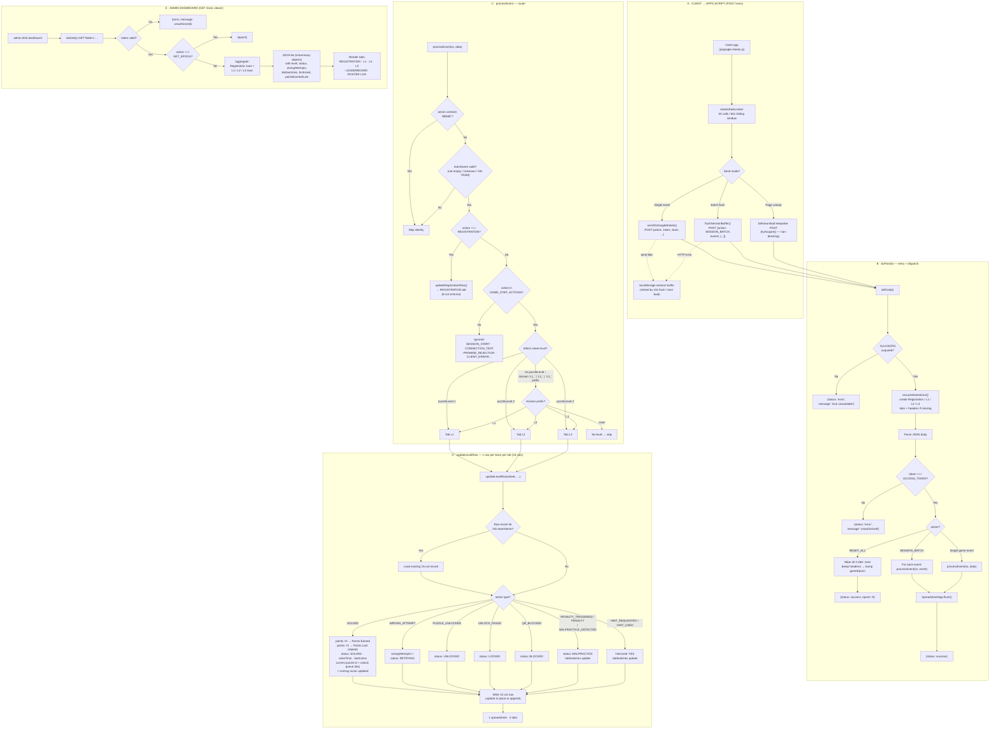

# ⚡ Pykachu Go — "Decode the code. Capture Pikachu."

A mobile-first, PWA-ready **binary signal decryption hunt** where teams solve
programming-riddle puzzles (Python & C++), scan QR codes, and progress through a
branching puzzle graph — all inside a Pokédex-styled CRT terminal UI.

Teams register with a team name + code, enter a `startCode` to unlock the first
puzzle, then solve puzzles in **forward-linked chains** where each correct answer
unlocks the next location. Progress, penalties, and points stream to a **Google
Sheets workbook** via a Google Apps Script backend, and an **Admin dashboard**
livetracks every team.

---

## 🎮 Features

- **Pokédex CRT theme** — pixel fonts, scanlines, sound effects, anti-blue-light
  CRT screen.
- **Dual-language riddles** — every puzzle ships a Python (`questionPython`) and
  a C++ (`questionCpp`) version; teams pick a language at registration.
- **Branching puzzle graph** — each puzzle declares what it unlocks via
  `nextPuzzleId`, so progression is a forward-linked DAG (see
  [`assets/docs/PUZZLE_LINKING_SYSTEM.md`](assets/docs/PUZZLE_LINKING_SYSTEM.md)).
- **Per-team unlock queue** — no jumping ahead; only puzzles pushed onto a
  team's frontier become scannable.
- **QR scanning** — live camera QR decoder (jsQR) with pinch-to-zoom, plus
  manual link entry (`?linkid=XG01`) and a fallback.
- **Anti-copy / anti-cheat** — blackout overlay on tab switch / window blur /
  print screen, multi-touch detection, logic-freeze heartbeat, drag & context
  menu blocking.
- **Hint system** — hint requests cost a timed penalty; tab switching during the
  penalty triggers "malpractice" monitoring.
- **Tab-switch penalty system** — 2-second grace period, blocking countdown,
  penalty rings.
- **YouTube meme rewards** — solving a puzzle can play a YouTube clip
  (`data/meme.json`) inside a custom video player.
- **Audio design** — synth SFX + background music with power mode toggle.
- **Google Sheets telemetry (per-puzzle envelope)** — each puzzle's every event
  (scan, wrong attempts, hints, tab switches, timestamps) is collected **locally**
  in a per-puzzle notebook and ships as **one request** on solve/abandon. 27
  requests per team for the whole event — ~13% of the Apps Script daily quota at
  100 teams.
- **Server-side team state** — no extra sheet: each team's **Current Puzzle ID**,
  the **Unlocked Puzzle IDs queue** (the one queue updated on every solve) and
  the **running score** live as columns right inside the team's L1/L2/L3 rows;
  clients re-derive the frontier on every load via `GET_TEAM_STATE`.
- **Sliding-window rate limiter** — protects the Apps Script endpoint from quota
  busts (see [Rate limiting](#-rate-limiting)).
- **GitHub Actions Auto-Deploy** — push to `main` → GitHub Pages.
- **Installable PWA** — service worker + manifest, offline-capable shell.

---

## 🛠 Tech Stack

| Layer | Tech |
|-------|------|
| Frontend | Vanilla JS (no framework), HTML partials, Tailwind CSS (compiled) |
| Styling | Tailwind CSS 3 (`npm run build`) + hand-written CSS modules |
| Backend | Google Apps Script (`scripts/GoogleAppsScript.gs`) |
| Storage | Google Sheets workbook (1 spreadsheet, 4 tabs) + `localStorage` state |
| Media | PokeAPI sprites/cries, YouTube IFrame API |
| Build | `esbuild` + `tailwindcss` (dev deps) |
| Hosting | GitHub Pages via Actions |
| LD deps (CDN) | jsQR, Tesseract.js, canvas-confetti |

---

## 📁 Project Structure

```
Pykachu_v3/
├── index.html            # Game shell (single-page app)
├── admin.html            # Admin / leaderboard dashboard
├── manifest.json         # PWA manifest
├── service-worker.js     # Offline PWA caching
├── tailwind.config.js    # Tailwind config
├── css/                  # Tailwind input + theme CSS modules
├── js/
│   ├── include.js        # Async partial loader (step0..step4, startcode, ...)
│   ├── config.js         # GOOGLE_SCRIPT_URL, token, CONFIG
│   ├── state.js          # Global game state, session id, unlock queue, epoch
│   ├── audio.js          # SFX + BGM
│   ├── data-loader.js    # Loads puzzle.json / teams.json / meme.json + preloader
│   ├── google-sheets.js  # Telemetry blueprint + GET_TEAM_STATE fetch + event throttle
│   ├── notepad.js        # Per-puzzle notebook (0 requests while solving)
│   ├── rate-limiter.js   # Sliding-window rate limiter (new)
│   ├── ui.js             # Toasts, UI helpers
│   ├── screens.js        # Step (screen) flow engine
│   ├── scanner.js        # QR camera + manual entry + zoom
│   ├── meme.js           # YouTube meme player
│   ├── penalty.js        # Tab-switch penalties + grace period
│   ├── hint.js           # Hint request + penalty + malpractice monitor
│   ├── game.js           # Registration, unlock, answer submission, scoring
│   ├── main.js           # Bootstrap, rules, final celebration confetti
│   └── security.js       # Blackout anti-cheat system
├── html/                 # Screen partials (step0..step4, startcode, hint, penalty, meme)
├── data/
│   ├── puzzle.json       # Puzzle definitions + progression graph
│   ├── teams.json        # Team roster + passwords + member lists
│   └── meme.json         # YouTube meme reward clips
├── scripts/
│   └── GoogleAppsScript.gs  # Apps Script backend (sheets + admin API)
├── assets/
│   ├── img/              # Sprites (oak, jenny, badges, trophies…)
│   └── docs/             # Design docs (puzzle linking system)
├── .github/workflows/    # Deploy-to-Pages workflows
└── package.json          # tailwind build + local serve
```

---

## 🎯 Game Flow

```
step0  Rules briefing  →  Registration (team code)  →  step2 QR / start-code
    →  startcode (enter START / puzzle code)  →  step3 Puzzle & answer form
    →  step4 SOLVED (confetti + next locations)  …
```

| Screen | Purpose |
|--------|---------|
| `step0` | Professor Oak's master rules |
| Registration | Team name + code, mission level (L1/L2/L3), language (Python/C++) |
| `step2` | QR camera scanner OR paste a code / deep-link |
| `startcode` | Enter the puzzle's start code (e.g. `START`) to unlock |
| `step3` | Read the riddle, submit answer, request hint |
| `step4` | Success screen: Pokémon reveal, points, **next location(s)** |
| `hint` / `penalty` | Hint reward overlay / tab-switch blocking overlay |
| `meme` | Optional YouTube clip reward after solving |

## 🔄 Client-Side Workflow (flowchart)

Complete decision map of the client app. Every code-level condition is shown as
a diamond → each branch is labelled. Loops = retry / back edges.

```mermaid
flowchart TD
    subgraph BOOT["1 · BOOT & DEEP LINK"]
        START["APP LOAD<br/>(index.html)"] --> LOAD["Load puzzles / teams / memes<br/>+ preload sprites & cries"]
        LOAD --> EPOCH{"GET_EPOCH:<br/>server epoch > local?"}
        EPOCH -- "Yes (reset)" --> WIPE["Wipe localStorage<br/>(score · queue · progress)"]
        EPOCH -- "No" --> RESTORE
        WIPE --> RESTORE["Restore saved team /<br/>language / current puzzle"]
        RESTORE --> DL["Resolve deep link<br/>(?linkid= / ?memid= / path)"]
        DL --> DLM{"Meme linked?"}
        DLM -- "Yes" --> MEMEPLAY["Show meme overlay"]
        MEMEPLAY --> RULES
        DLM -- "No" --> DLG{"Puzzle linked &<br/>isPuzzleAllowed()?"}
        DLG -- "No" --> DLREJ["Toast: Access Denied"]
        DLG -- "Yes" --> RULES
        DLREJ --> RULES
    end

    RULES["STEP 0 — Rules briefing"] -->|"acceptRules()"| REG["STEP 1 — Registration"]

    subgraph REGS["2 · REGISTRATION"]
        REG --> EMPTYREQ{"Team or password<br/>empty?"}
        EMPTYREQ -- "Yes" --> REGERR["Toast: fields required"]
        REGERR --> REG
        EMPTYREQ -- "No" --> TEXIST{"Team in<br/>teams.json?"}
        TEXIST -- "No" --> TNOTF["'Trainer not found'<br/>+ shake"]
        TNOTF --> REG
        TEXIST -- "Yes" --> PWOK{"password ===<br/>passwordHash?"}
        PWOK -- "No" --> PWBAD["'Incorrect security key'<br/>+ shake"]
        PWBAD --> REG
        PWOK -- "Yes" --> TEAMSET["Set team / tid / mission / language<br/>create sessionId · REGISTRATION log"]
        TEAMSET --> TDL{"Deep-linked puzzle<br/>set & starting?"}
        TDL -- "Yes" --> STARTCODE["STEP startcode"]
        TDL -- "No" --> TDL2{"Deep-linked puzzle<br/>set & allowed?"}
        TDL2 -- "Yes" --> ACTIVATE["activatePuzzle()<br/>PUZZLE_UNLOCKED log"]
        TDL2 -- "No" --> SCAN
        TEAMSET -- "No deep link" --> SCAN
    end

    subgraph SCANR["3 · SCAN / UNLOCK"]
        SCAN["STEP 2 — QR scanner"] --> DETECT["Detect QR / OCR / manual code"]
        DETECT --> SE{"Manual entry<br/>empty?"}
        SE -- "Yes" --> SEERR["Toast: Enter a valid Signal ID"]
        SEERR --> DETECT
        SE -- "No" --> DMD{"Meme id matched?"}
        DMD -- "Yes" --> MEMEPLAY
        DMD -- "No" --> DPD{"Puzzle link /<br/>start-code recognized?"}
        DPD -- "No" --> BADQR["Toast: Invalid Signal"]
        BADQR --> DETECT
        DPD -- "Yes" --> GATE{"isPuzzleAllowed()?<br/>(in unlock queue)"}
        GATE -- "No" --> BLOCK["QR_BLOCKED log<br/>Toast: Access Denied"]
        BLOCK --> DETECT
        GATE -- "Yes" --> STARTY{"Starting puzzle<br/>(has startCode)?"}
        STARTY -- "Yes" --> STARTCODE
        STARTY -- "No" --> ACTIVATE
    end

    subgraph STARTR["4 · START CODE"]
        STARTCODE --> SUBKEY["Submit start key"]
        SUBKEY --> KEYEMPTY{"Key empty?"}
        KEYEMPTY -- "Yes" --> KERR["Toast: Enter start key"]
        KERR --> SUBKEY
        KEYEMPTY -- "No" --> KSEL{"Deep-linked puzzle<br/>present?"}
        KSEL -- "Yes" --> KNORM{"Starting &<br/>key === startCode?"}
        KNORM -- "Yes" --> ACTIVATE
        KNORM -- "No" --> KALLOW{"Non-start &<br/>isPuzzleAllowed()?"}
        KALLOW -- "Yes" --> ACTIVATE
        KALLOW -- "No" --> BADKEY
        KSEL -- "No" --> KPASS{"Any starting puzzle:<br/>key === startCode?"}
        KPASS -- "Yes" --> ACTIVATE
        KPASS -- "No" --> BADKEY["UNLOCK_FAILED log<br/>Error + shake"]
        BADKEY --> STARTCODE
    end

    ACTIVATE --> QUIZ["STEP 3 — Riddle + answer form"]

    subgraph ASR["5 · ANSWER & SOLVE"]
        QUIZ --> ANS{"Submit answer<br/>(answerForm)?"}
        ANS -- "No" --> HINTREQ
        ANS -- "Yes" --> AEMPTY{"Answer empty?"}
        AEMPTY -- "Yes" --> TE["Toast: INPUT REQUIRED"]
        TE --> QUIZ
        AEMPTY -- "No" --> ANO{"currentPuzzle<br/>loaded?"}
        ANO -- "No" --> APZ["Toast: NO PUZZLE LOADED"]
        APZ --> QUIZ
        ANO -- "Yes" --> ACUR{"standardizeString(answer)<br/>=== puzzle.answer?"}
        ACUR -- "No" --> WRONG["WRONG_ATTEMPT log<br/>glitch + shake + clear"]
        WRONG --> QUIZ
        ACUR -- "Yes" --> FIRST{"First solve of<br/>this puzzle?"}
        FIRST -- "Yes" --> BASE["+ points<br/>(puzzle.points)"]
        BASE --> REC
        FIRST -- "No" --> REP["−25% points<br/>(repeat solve deduction)"]
        REP --> REC
        REC["recordPuzzleSolve() · push nextPuzzleId<br/>to unlock queue · SOLVED log"] --> ENDCHK{"Final puzzle?<br/>(nextPuzzleId empty)"}
        ENDCHK -- "Yes" --> COMPLETE["STEP 4 — Completion<br/>trophy · confetti · GAME COMPLETE"]
        ENDCHK -- "No" --> SUC["STEP 4 — Success + Pokémon reveal"]
        SUC --> BRANCH{"nextPuzzleId length?"}
        BRANCH -- "1" --> S1["Single next-location card"]
        BRANCH -- "2+" --> SM["One card per branch"]
        S1 --> NXT["Next Signal pressed"]
        SM --> NXT
        NXT --> NXTF{"Still final?<br/>(safety re-check)"}
        NXTF -- "Yes" --> COMPLETE
        NXTF -- "No" --> SCAN
    end

    subgraph HINTR["6 · HINT SYSTEM"]
        HINTREQ{"Hint requested?"} -- "Yes" --> HV{"Puzzle has a valid<br/>hint? (isHintValid)"}
        HINTREQ -- "No" --> QUIZ
        HV -- "No" --> NOH["Hint button hidden"]
        NOH --> QUIZ
        HV -- "Yes" --> HU{"Already paid /<br/>hintUsed?"}
        HU -- "Yes" --> SHOWHINT["showHint() — free reopen"]
        SHOWHINT --> QUIZ
        HU -- "No" --> CONFIRM{"Confirm overlay:<br/>confirm / cancel / 30s timeout?"}
        CONFIRM -- "Cancel or timeout" --> CNCL["cancelHintRequest()<br/>toast: timed out"]
        CNCL --> QUIZ
        CONFIRM -- "Confirm" --> HPTN["Hint penalty countdown<br/>(hintPenalty seconds)"]
        HPTN -- "Timer hits 0" --> SHOWHINT2["showHint() + HINT_USED log"]
        SHOWHINT2 --> QUIZ
        HPTN -. "tab switch during<br/>(malpractice)" .-> MALP["15s malpractice blocking penalty<br/>MALPRACTICE + PENALTY logs"]
        MALP --> HPTNR["resumeHintPenalty()<br/>timer RESET to full"]
        HPTNR --> HPTN
    end

    subgraph PENR["7 · TAB-SWITCH PENALTY (step 3 only)"]
        TOK{"Hidden / blurred 1.5s<br/>& puzzle active (step 3)?"}
        TOK -- "No" --> MON["No-op — monitoring continues"]
        MON --> TOK
        TOK -- "Yes" --> TODD{"hintPenaltyActive?"}
        TODD -- "Yes" --> MALP
        TODD -- "No" --> TODD2{"Penalty already<br/>active?"}
        TODD2 -- "Yes" --> TRESET["Reset to 15s + restart<br/>PENALTY_TRIGGERED log"]
        TRESET --> TOK
        TODD2 -- "No" --> TSTRT["Start 15s blocking countdown<br/>PENALTY_TRIGGERED log"]
        TSTRT --> TZERO{"Timer <= 0?"}
        TZERO -- "No (tick ↓)" --> TZERO
        TZERO -- "Yes" --> CLEAR["clearPenalty() → resume"]
        CLEAR --> QUIZ
    end

    subgraph SECR["8 · SECURITY BLACKOUT (always on)"]
        BL1{"Tab hidden / window<br/>blur / pagehide?"} -- "Yes" --> BLK["Full-screen blackout overlay"]
        BL2{"PrintScreen / Ctrl+P / Ctrl+S<br/>/ Ctrl+U / Meta+Shift+3|4?"} -- "Yes" --> BLK
        BL3{"5-finger touch gesture?"} -- "Yes" --> BLK
        BL4{"Logic freeze<br/>(heartbeat gap > 3s)?"} -- "Yes" --> BLK
        BL1 -- "No" --> ACTV
        BL2 -- "No" --> ACTV
        BL3 -- "No" --> ACTV
        BL4 -- "No" --> ACTV
        BLK --> BLREL["Auto release<br/>(300ms – 2s)"]
        BLREL --> ACTV["Return to active screen"]
        ACTV -. "listeners re-arm" .-> BL1
    end
```



Every loop-back at a glance:
- **Step 2 ⇄ scanner**: empty / unrecognized / queue-blocked signals keep the
  scanner open (`DETECT` sink).
- **Step 3 retry**: wrong answer, no-puzzle, empty input, or finishing a hint
  always returns to the riddle.
- **Step 4 → Step 2**: pressing **Next Signal** loops back to scanning the next
  location until the final puzzle (safety re-check included).
- **startcode**: empty or wrong keys bounce back to the key pad.
- **Hint**: cancel/timeout return to the riddle; a tab switch mid-countdown
  runs the 15s malpractice penalty, then **resets** the hint timer.
- **Penalty**: a second tab switch while already penalized resets the 15s
  countdown instead of stacking a new one.
- **Security**: every suspicious trigger fires the blackout, then auto-releases
  and re-arms the listeners.

---

## 🧩 Puzzle Data (`data/puzzle.json`)

Each puzzle is an object:

```jsonc
{
  "id": 1,              // unique numeric id (graph node)
  "linkid": "XG01",     // public short code used in QR / deep links
  "questionPython": "…",// riddle in Python
  "questionCpp": "…",   // riddle in C++
  "answer": "-5",       // single correct answer (string compare)
  "nextPuzzleId": [2, 6], // puzzle ids this one UNLOCKS (forward edge list)
  "startCode": "START", // presence marks a starting puzzle
  "locationClue": "CSE entrance - openspace",
  "level": 1,           // 1 | 2 | 3 (routes telemetry to L1/L2/L3 tab)
  "points": 10,
  "hint": "BODMAS",
  "hintPenalty": 10,    // seconds the hint costs
  "pokemonId": 39       // PokeAPI sprite + cry to reveal on solve
}
```

Rules:

- **Starting puzzles** have `startCode` — the ONLY thing a fresh team can unlock.
- **Chains** are forward-linked: `nextPuzzleId` lists every puzzle this solve
  unlocks (branching allowed, e.g. `[2, 6]`).
- **Final puzzles** have `nextPuzzleId: []`.
- **Gated** links are enforced by the per-team **unlock queue**
  (`localStorage` `scoreState.<team>.queue`); scanning anything not in the queue
  is a "jump" and is **blocked** + logged.

Current dataset: **7 puzzles** — L1: ids 1–4, L2: 5–6, L3: 7 (final).

> See [`assets/docs/PUZZLE_LINKING_SYSTEM.md`](assets/docs/PUZZLE_LINKING_SYSTEM.md)
> for the full design + migration notes.

---

## 👥 Teams (`data/teams.json`)

```jsonc
[
  {
    "team": "PRANAV",
    "passwordHash": "123",
    "tid": "T001",
    "team_members": ["A", "B", "C", "D"]
  }
]
```

- Inline JSON roster (no server). Team logs in with `team` + `passwordHash`.
- `tid` is the stable team id used inside the backend spreadsheet.
- (Note: `passwordHash` is currently plain text — fine for an event tournament,
  but do not use for anything sensitive.)

---

## 🖼 PokeAPI Assets (images, cries, badges)

All Pokémon artwork, cries and gym badges come from the **PokeAPI** sprite/audio
repos (no API key needed — they are static GitHub files loaded at runtime).
`{pokemonId}` comes from the puzzle's `pokemonId` field; badges reuse the puzzle
`id`.

| Asset | Where used | URL template |
|-------|-----------|--------------|
| Official artwork (caught Pokémon) | `js/data-loader.js:26`, `js/game.js:267` | `https://raw.githubusercontent.com/PokeAPI/sprites/master/sprites/pokemon/other/official-artwork/{pokemonId}.png` |
| Pokémon cry (pre-cached on load) | `js/data-loader.js:27` | `https://raw.githubusercontent.com/PokeAPI/cries/main/cries/pokemon/latest/{pokemonId}.ogg` |
| Gym badge (by puzzle id) | `js/data-loader.js:30`, `js/screens.js:64` | `https://raw.githubusercontent.com/PokeAPI/sprites/master/sprites/badges/{puzzleId}.png` |

Useful roots:

- Main API & docs: <https://pokeapi.co>
- Sprite repository: <https://github.com/PokeAPI/sprites>
- Raw sprite tree: <https://raw.githubusercontent.com/PokeAPI/sprites/master/sprites/>
- Cries repository: <https://github.com/PokeAPI/cries>

Extra external media:

- Background music (Pokémon Showdown): <https://play.pokemonshowdown.com/audio/music/battle-trainer.mp3> (set in `js/main.js:229`)
- Google Fonts (Press Start 2P, JetBrains Mono, Handlee, Pixelify Sans): <https://fonts.googleapis.com>
- Material Symbols Rounded: <https://fonts.googleapis.com>

---

## 🏢 Backend — Google Apps Script (`scripts/GoogleAppsScript.gs`)

A single Google Apps Script web app that owns one Google Sheets workbook.

### Workbook tabs

| Tab | Schema |
|-----|--------|
| `Registration` | Registration Time, TID, Team Name, Mission, Language, Password, Level, Session ID |
| `L1` / `L2` / `L3` | Last Active, TID, Team Name, Mission, Wrong Attempts, Solve Time, Hint Used (1/0), Tab Switches, Solved Puzzle IDs, Current Puzzle ID, Unlocked Puzzle IDs, Status, Points Earned, Points Lost, Total Score |

### Design decisions

- **1 row per team per tab** — a team's row is created once, then updated
  in place (no event log spam).
- Events are routed by puzzle **level** to `L1`/`L2`/`L3`
  (fallback: team's registered mission level).
- `Registration` events only touch the Registration tab.
- **Points Earned** = sum of positive `SOLVED` points; **Points Lost** = sum of
  |negative| repeat-solve deductions — the Admin leaderboard ranks on these.
- **`SOLVED`** ships the full per-puzzle notebook in one call and
  max-assigns `Wrong Attempts`, `Tab Switches`, `Hint Used`, and appends the
  solved `puzzleId` to the **Solved Puzzle IDs** CSV for that level; abandoned
  puzzles go through **`PUZZLE_ABANDONED`** (1 call) with the half-done
  notebook intact.
- `Registration` stores the security key (the owner's call) — it is **never**
  returned by the admin `doGet` endpoint.
- Each team's L1/L2/L3 row also carries the **Current Puzzle ID** (last solved),
  the **Unlocked Puzzle IDs queue** — THE single queue, every unlock from each
  SOLVED envelope merged in uniquely — and the **Total Score**, so there is
  **no separate TeamState tab**. `GET_TEAM_STATE` re-aggregates these columns
  across L1/L2/L3; the client derives the frontier as
  `unlocked − locally-solved` on refresh.
- Uses `LockService` for concurrency safety on every POST.
- Token auth: every request carries `{ token: GOOGLE_SCRIPT_TOKEN }`.

### API surface

| Endpoint | Action | Description |
|----------|--------|-------------|
| `POST` (key `action`) | `REGISTRATION` | Create/update the team's registration row |
| `POST` | game-step actions | `QR_SCANNED`, `QR_BLOCKED`, `PUZZLE_UNLOCKED`, `UNLOCK_FAILED`, `SOLVED`, `WRONG_ATTEMPT`, `HINT_REQUESTED`, `HINT_USED`, `PENALTY`, `MALPRACTICE_DETECTED`, `PUZZLE_ABANDONED`… |
| `POST` | `SESSION_BATCH` | Flush multiple buffered events in one call |
| `GET` | `GET_TEAM_STATE` | Aggregated current puzzle id + unlocked queue + score for a team (from L1/L2/L3 rows) |
| `POST` | `RESET_ALL` | Wipe all sheets (Registration, L1, L2, L3) + bump the game **epoch** |
| `GET?token=…` | — | Aggregated JSON for the Admin dashboard (registrations + per-level summaries) |
| `GET` | `GET_EPOCH` | Return current game epoch (clients wipe stale local progress on change) |

Game-step actions are whitelisted in `GAME_STEP_ACTIONS`; telemetry like
`SESSION_START`, `CONNECTION_TEST`, `PROMISE_REJECTION` is intentionally ignored.

### 🔀 Backend data flow (flowchart)

Where every packet goes from the moment the player does something. This is the
App-Script-side logic; each diamond = a server-side condition.



Reading notes:

- **A → B**: everything the client sends travels through the rate limiter, then
  a single POST lands in `doPost` (CORS + batch-safe).
- **B**: one script lock per request; `RESET_ALL` (epoch bump) is the only thing
  that touches *all* tabs at once.
- **C**: routing is by puzzle level first (`puzzleLevel`), then mission prefix —
  so an L1 puzzle's events never land in `L2`.
- **D**: a team keeps **one row per tab**; columns are updated in place, and
  each action type flips a specific status column.
- **E**: the admin dashboard is a pure reader — it aggregates the four tabs
  into JSON and the browser renders the leaderboard.

---

## 🛡 Rate Limiting

`js/rate-limiter.js` implements a client-side **sliding-window rate limiter**
for all Google Sheets API calls:

- Config (in `js/google-sheets.js`): `limit: 30` calls per `windowMs: 60000`
  (60 s rolling window).
- Requests are spaced `windowMs / limit` (2 s) apart automatically.
- Holds call timestamps in `localStorage` (`pykachuSheetsRateLimit`) so reduced
  quota survives page reloads.
- `acquire()` — awaited by `sendToGoogleSheets` and batch `flushSessionBuffer`.
- `tryAcquire()` — non-blocking slot used by the `beforeunload` flush; if the
  window is full the buffer is kept for the next session's 10 s flush instead of
  dropping events.

---

## Per-Puzzle Notebook (`js/notepad.js`)

The key quota-saving mechanism: **every event while a puzzle is open is counted
locally** (scan, wrong, hint, tab switch, timestamps) in a small in-memory
notepad — zero requests fire during solving.

- **On solve** → one `SOLVED` request carries the full notebook summary +
  the unlock queue (`queueIds`), current `puzzleId`, the running `score` and
  the solved `puzzleId` history — the backend writes these straight into the
  team's level row (no separate tab).
- **Left mid-puzzle** → after 60 s idle the watchdog sends one
  `PUZZLE_ABANDONED` with the half-done notebook. The notepad lives in
  `localStorage` (`pykachuPuzzleNotebook`) so a mid-puzzle reload never loses
  progress.
- `beforeunload` flushes dirty notebooks rate-limit-safe (non-blocking
  `keepalive` fetch). If the rate window is full the note stays dirty and
  the next load's watchdog retries.

**Resulting request count at 100 teams:**  
1 registration + 24 solves + 2 startup = **27 requests / team / day**  
→ **~2,700 total / day ≈ 13%** of the Google Apps Script ~20k daily quota.

---

## Input Caps & Hidden IDs

- All user text inputs (team name, password, start key, answer, manual signal
  id) are capped at **50 characters** via both `maxlength` and JS guards in the
  submit handlers.
- Puzzle signal IDs (e.g. `XG01`) are **never displayed** in the UI — only
  used internally for QR matching, deep links and server payloads.

---

## 🛡 Anti-Cheat (“Extreme Security System”)

`js/security.js` blackouts the ENTIRE CRT screen instantly when cheating is
suspected:

- Tab switch / app background / window blur / page hide
- PrintScreen & common inspector/reload shortcuts
- 5-finger multi-touch gesture
- Logic-freeze detection (heartbeat every 2 s, 3 s tolerance)
- Context menu & drag blocking

## ⏱ Penalties & Hints

- **Tab-switch penalty** (`js/penalty.js`): 2 s grace countdown → blocking
  countdown with penalty ring → event logged.
- **Hint system** (`js/hint.js`): requesting a hint triggers a confirm dialog,
  then a timed penalty (`hintPenalty` seconds). Switching tabs during that
  window marks the team as malpractice-prone and can re-apply/block.

---

## 🖥 Admin Dashboard (`admin.html`)

Standalone page (own Tailwind build) with live tabs:

- **REGISTRATION** — who registered, language, mission
- **LEVEL L1 / L2 / L3** — per-team live status per level
- **LEADERBOARD** — ranked by Points Earned
- **ROSTER LOG** — full team roster with members

The dashboard queries the Apps Script `doGet` endpoint with the token and
renders aggregated JSON. Client-side config lives at the top of the page.

---

## 💾 PWA

- `manifest.json` — standalone install, portrait, maskable icon.
- `service-worker.js` — caches shell + data for offline reloads.
- Requires HTTPS (GitHub Pages provides it).

---

## 🚀 Deployment (GitHub Pages)

Repo links to Pages via `.github/workflows/static.yml` (+ a Jekyll variant):

1. Push to `main`.
2. `actions/deploy-pages` publishes the whole repo root.
3. Live site rebuilds automatically; all data (`data/*.json`) is static JSON, so
   updating puzzles/teams and pushing is a live content update.

---

## 🛠 Local Development

```bash
# 1. Build compiled Tailwind CSS (only if you touch css/tailwind-input.css)
npm install
npm run build

# 2. Serve the folder (SPA)
npm run serve
# → http://localhost:3000 (or whatever npx serve prints)
```

Static files only — no bundler needed for the app JS.

---

## ⚙️ Key Configuration (`js/config.js`)

```js
const GOOGLE_SCRIPT_URL   = 'https://script.google.com/macros/s/…/exec';
const GOOGLE_SCRIPT_TOKEN = 'pyk2026@secGX42';

const CONFIG = {
  HINT_SETTINGS: { defaultPenalty: 60, hintRequestTimeout: 30, tabSwitchResetsPenalty: true },
  FEATURES:      { hintSystem: true },
  STORAGE_KEYS:  { /* localState keys */ }
};
```

> ⚠️ The token is embedded in client code (it is in every browser anyway).
> Use the same script for all environments; never treat it as a secret.

---

## 🧰 Common Operations

| Task | How |
|------|-----|
| **Add a puzzle** | Add an object to `data/puzzle.json`; link it via `nextPuzzleId`; bump points/hints/pokemonId. |
| **Add / edit teams** | Edit `data/teams.json` (team, passwordHash, tid, team_members). |
| **Add a meme reward** | Push a `{ videoId, start, end }` object to `data/meme.json`. |
| **Reset the whole event** | Call the backend `RESET_ALL` (wipes all 4 tabs + bumps epoch; clients auto-wipe stale progress). |
| **Tune sheet quota** | Adjust `limit`/`windowMs` on `sheetsRateLimiter` in `js/google-sheets.js`. |

---

## 📄 Docs

- [`assets/docs/PUZZLE_LINKING_SYSTEM.md`](assets/docs/PUZZLE_LINKING_SYSTEM.md) —
  full puzzle linking / progression design.
- `assets/docs/*.docx` — original challenge brief & links.